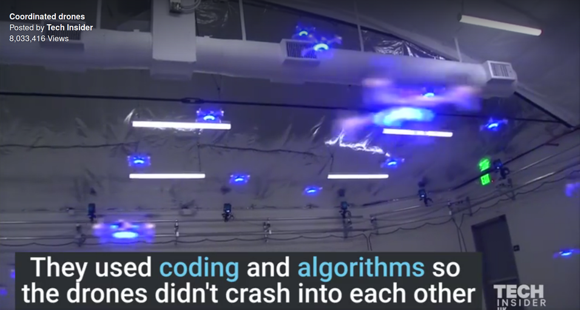

# if goingToCrash: Don't
> RISC-V Architecture for Motion Planning Algorithms in Autonomous UAVs

This repository holds the working files of my Senior Thesis, submitted in partial fulfillment of the requirements for the degree of Bachelor of Science in Electrical Engineering at Harvard University.

This thesis presents an extension for the RISC-V Instruction Set Architecture (ISA) for the purpose of faster motion planning in autonomous Unmanned Aerial Vehicles (UAVs). Fully autonomous UAVs have the potential to change the world in which we live, but they are currently unable to pilot themselves in high-complexity, obstacle-dense environments; The processors that they employ cannot execute motion planning software quickly enough. RISC-V is a relatively new ISA that is founded on the principles of open-source and extendibility, making it an excellent ecosystem for designing application specific processors. However, as of April 2020, no attempts had been made to develop motion planning archi- tecture within the RISC-V ecosystem.
This thesis serves as a proof-of-concept for accelerating motion planning with RISC-V architecture. It presents the implementation of “HoneyBee”, a microarchitectural unit that can compute collision detection over 5 times faster than a general-purpose Intel CPU. More significantly, it defines a motion planning extension for RISC-V that simplifies the number of instructions required to detect an edge collision from hundreds of thousands to only one. These promising results demonstrate the viability of the approach, and should en- courage developers to embrace RISC-V in the development of motion planning processors for autonomous drones.

## Table of Contents
+ [Repository Structure](#structure)
	
## Repository Structure
+ [Research](#research)
+ [Writeups](#writeups)
+ [RRT](#rrt)
+ [PhilosophyV](#phil_v)
+ [HoneyBee](#honeybee)

### Research
This folder holds the academic papers that constitute the background research of this Thesis.

### Writeups
This folder holds the writeups required for this Thesis.
- Includes checkpoints in fulfillment of Harvard's ES100hf class.
- Includes Final Report

### RRT
This subrepository holds:
	- 3D capable Rapidly Exploring Random Tree implementation in C.
	- Python implemented analysis tool for running Top Down Analysis of CPU performance.

### PhilosophyV
This subrepository holds the PhilosophyV RISCV chip

### HoneyBee
This subrepository holds the HoneyBee functional unit, a hardware implementation of collision detection.
